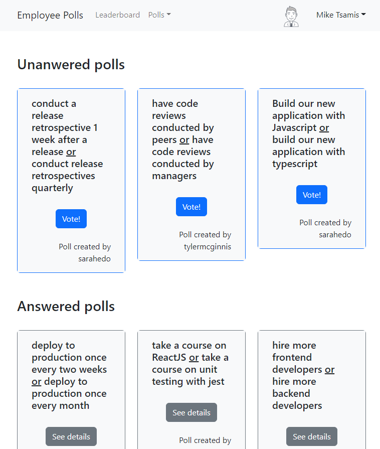

# Employee Polls Project

This is my second project for the [Udacity React Nanodegree](https://www.udacity.com/course/react-nanodegree--nd019).
The front-end was built from scratch using using React by running `create-react-app`, but scaffolded with styles and components by [Bootstrap](https://react-bootstrap.github.io/). State is powered by [Redux Toolkit](https://redux-toolkit.js.org/), and the data is coming from [_DATA.js](./_DATA.js), which was provided by Udacity.  
The `_DATA.js` file represents a fake database and methods that let you access the data. Routing is handled by [React Router](https://v5.reactrouter.com/web/guides/quick-start).

The employee poll app supports four employees. It allows users to vote, see all polls, and create new ones.  Additionally, there is a leaderboard view that sorts users by app activity. The app is user-friendly and response.

The app is deployed to GitHub Pages.  You can access it [here](https://malaktayeh.github.io/react-nanodegree-employee-polls).

;

The starter code for the final assessment project for Udacity's React & Redux course can be found [here](https://github.com/udacity/nd0191-c1-myreads) and the passing rubric can be reviewed [here](https://review.udacity.com/#!/rubrics/4684/view) as well.

## Running the app

To get started developing right away:

- download (or fork and download) this repo by running `git clone https://github.com/malaktayeh/react-nanodegree-myreads` in your terminal
- install all project dependencies with `npm install`
- start the development server with `npm start`
- run jest unit tests by executing `npm test`

You can also run in in the browser! Press `.` on this page or [here](https://github.dev/malaktayeh/react-nanodegree-myreads) to launch (:

## Requirements

- [Node.js](https://nodejs.org/) and [npm](https://www.npmjs.com/)
- A code editor if you want to run it locally (I use [VS Code](https://code.visualstudio.com/))

## Future to-dos

- ~~Deploy to [heroku](https://www.heroku.com/)~~ deployed to GitHub Pages, see [here](https://malaktayeh.github.io/react-nanodegree-employee-polls).
- Make components more reusable (ran out of time!)
- Write more unit tests
- Improve UI

## Data

There are two types of objects stored in our database:

* Users
* Questions

### Users

Users include:

| Attribute    | Type             | Description           |
|-----------------|------------------|-------------------         |
| id                 | String           | The user’s unique identifier |
| password   | String           | The user’s password in order to log in the application |
| name          | String           | The user’s first name  and last name     |
| avatarURL  | String           | The path to the image file |
| questions | Array | A list of ids of the polling questions this user created|
| answers      | Object         |  The object's keys are the ids of each question this user answered. The value of each key is the answer the user selected. It can be either `'optionOne'` or `'optionTwo'` since each question has two options.

### Questions

Questions include:

| Attribute | Type | Description |
|-----------------|------------------|-------------------|
| id                  | String | The question’s unique identifier |
| author        | String | The author’s unique identifier |
| timestamp | String | The time when the question was created|
| optionOne | Object | The first voting option|
| optionTwo | Object | The second voting option|

### Voting Options

Voting options are attached to questions. They include:

| Attribute | Type | Description |
|-----------------|------------------|-------------------|
| votes             | Array | A list that contains the id of each user who voted for that option|
| text                | String | The text of the option |

Your code will talk to the database via 4 methods:

* `_getUsers()`
* `_getQuestions()`
* `_saveQuestion(question)`
* `_saveQuestionAnswer(object)`

1) `_getUsers()` Method

*Description*: Get all of the existing users from the database.  
*Return Value*: Object where the key is the user’s id and the value is the user object.

2) `_getQuestions()` Method

*Description*: Get all of the existing questions from the database.  
*Return Value*: Object where the key is the question’s id and the value is the question object.

3) `_saveQuestion(question)` Method

*Description*: Save the polling question in the database. If one of the parameters are missing, an error is thrown.
*Parameters*:  Object that includes the following properties: `author`, `optionOneText`, and `optionTwoText`. More details about these properties:

| Attribute | Type | Description |
|-----------------|------------------|-------------------|
| author | String | The id of the user who posted the question|
| optionOneText| String | The text of the first option |
| optionTwoText | String | The text of the second option |

*Return Value*:  An object that has the following properties: `id`, `author`, `optionOne`, `optionTwo`, `timestamp`. More details about these properties:

| Attribute | Type | Description |
|-----------------|------------------|-------------------|
| id | String | The id of the question that was posted|
| author | String | The id of the user who posted the question|
| optionOne | Object | The object has a text property and a votes property, which stores an array of the ids of the users who voted for that option|
| optionTwo | Object | The object has a text property and a votes property, which stores an array of the ids of the users who voted for that option|
|timestamp|String | The time when the question was created|

4) `_saveQuestionAnswer(object)` Method

*Description*: Save the answer to a particular polling question in the database. If one of the parameters are missing, an error is thrown.
*Parameters*: Object that contains the following properties: `authedUser`, `qid`, and `answer`. More details about these properties:

| Attribute | Type | Description |
|-----------------|------------------|-------------------|
| authedUser | String | The id of the user who answered the question|
| qid | String | The id of the question that was answered|
| answer | String | The option the user selected. The value should be either `"optionOne"` or `"optionTwo"`|

